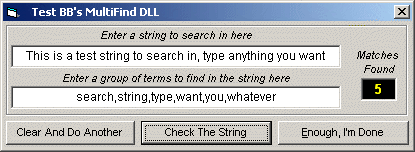



## BBMultiFind

### Description

Compares a string to a list of items in another string, and returns how many matches are found
 
### More Info
 
a string made up of a comma-delimited list of any text items

can be used as a DLL so it's available to other apps, even Microsoft Office apps, or just cut and paste the simple code into your own VB applications

an integer, the count of how many matches were found

             |
---                |---
**Submitted On**   |2001-06-02 20:07:08
**By**             |[Brian Battles WS1O](https://github.com/Planet-Source-Code/PSCIndex/blob/master/ByAuthor/brian-battles-ws1o.md)
**Level**          |Beginner
**User Rating**    |4.8 (19 globes from 4 users)
**Compatibility**  |VB 6\.0
**Category**       |[String Manipulation](https://github.com/Planet-Source-Code/PSCIndex/blob/master/ByCategory/string-manipulation__1-5.md)
**World**          |[Visual Basic](https://github.com/Planet-Source-Code/PSCIndex/blob/master/ByWorld/visual-basic.md)
**Archive File**   |[BBMultiFin20460622001\.zip](https://github.com/Planet-Source-Code/brian-battles-ws1o-bbmultifind__1-23721/archive/master.zip)

